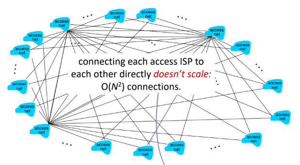
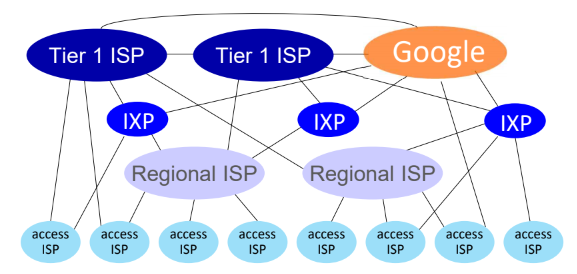

# ISP
>작성자 : 심세원

 

 

Chapter 1-2-2

**End systems connect to Access networks**

→ Access networks를 통해 End systems(Host)가 연결 가능

그렇다면 Access network를 관리하는 것은?

# ISP

> Internet Service Provider (= access network), 인터넷 서비스 제공자
> 

ISP 회사가 제공하는 것이 access network

ISP 회사 예시)

- SKT
- KT
- U+
  
 

# Internet structure: network of network

network of network : 네트워크망

- ISP에 접속하는 것은 상호 연결되어야 한다.
    - 네트워크망
    - 두 호스트가 서로 패킷을 보낼 수 있도록
- 네트워크망은 복잡하다
    
     

### 수백만 개의 접속 ISP가 주어졌을 때 이들을 어떻게 연결할 것인가

→ 이런식으로 서로 서로를 모두 연결하면 복잡도가 O(n^2)이 됨

→ 비효율적, 너무 오랜 시간이 소요됨

### 따라서, 이런 global transit ISP에 연결하기로 고객과 제공자가 합의를 함

**더 자세히 알아보면**

***IXP (Internet exchange point), Peering Link***

 다른 네트워크 및 인터넷 서비스 제공업체(ISP) 간에 데이터 교환 및 라우팅을 위한 중요한 인터넷 인프라 요소

→이들이 각각의 ISP들을 이어준다

***regional ISP***

→ regoinal ISP가 ISP에 Access Nets를 연결시켜준다

***Content provider network***

→ Content provider network는 자신의 네트워크를 운영해, 사용자(end user)에게 더 가깝게 서비스, 콘텐츠를 제공할 수 있다.

ex) Google, Microsoft, Akamai

### 이렇게 네트워크망은 3계층으로 이루어 진다

→ 제일 위의 계층은 국가 단위 ISP