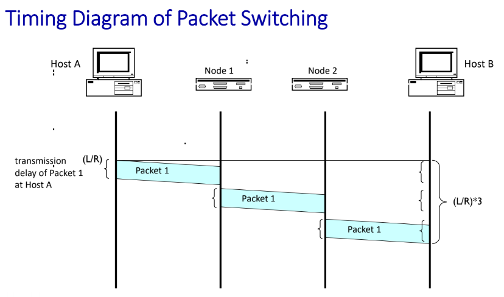
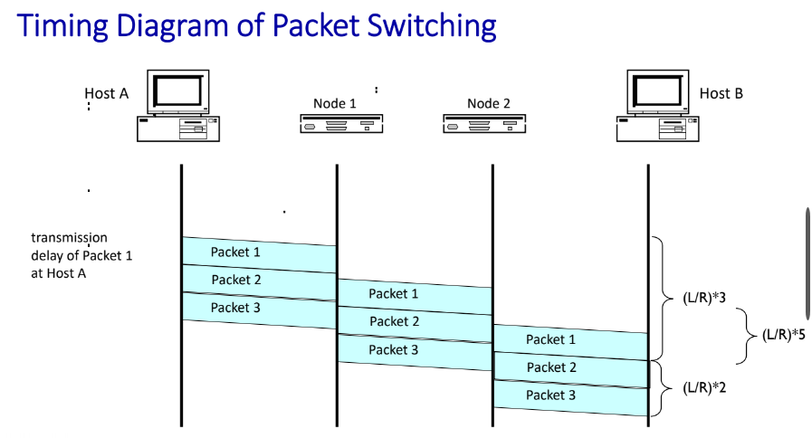

# Packet Switching

> 작성자: 심세원

<br>

<br>

Chapter 1-3

## Packet

> 패킷 방식의 컴퓨터 네트워크가 전달하는 데이터의 형식화 된 블록
> 

컴퓨터 간에 데이터를 주고받을 때, 네트워크를 통해서 전송되는 데이터 조각

(데이터를 통으로 보내는 것이 아님)

→WHY?

1. 큰 데이터는 대역폭을 많이 차지
2. 패킷의 흐름을 원활하게 하지 못함 (트래픽이 많아짐)

ex) 도로가 4차선인데, 차가 3차선을 차지하며 지나감

<br>

패킷 교환 방식(Packet Switching) 예시)

1. 큰 사진 하나를 상대방에게 보냄
2. 큰 사진을 작은 패킷으로 분할함
3. 작은 패킷들로 분할된 사진은 상대방에게 번호를 붙여서 전달됨
    
    그래야지, 순서대로 나열했을 때 원하는 사진을 볼 수 있음
    

레퍼런스) https://enlqn1010.tistory.com/9

<br>

# Packet Switching

→ 라우터가 Packet의 헤더에 담긴 정보로 길을 찾아서 Switching 해줌

1. Device가 app data message를 보내야함
2. bit 단위의 packet로 나눠서 보냄
    
    TCP packet의 maximum은 1500Byte ( 8bits= 1byte )
    
3. Router는 수신된 packet을 어디로 보낼지 생각함
    
    Header에 packet의 목적지가 적혀있음

<br>    

## Transmission Delay

**L** → 패킷의 길이 ( L bits )

**R** → Transmission rate, data를 내보내는 속도 ( R bps ), bps = bits/sec

```
transmission delay = L/R = time needed to transmit L-bit packet into link
```

**비유하면,**

**`transmission rate`** → 말의 속도

**`transmission delay`** → 귀에 공기를 타고 들어가는 속도

<br>

### Packet이 여러 곳을 거쳐 갈 때, Packet이 모두 도착한 뒤 다시 보냄

1. Packet을 보냄
2. Packet을 받아서 저장을 시킴
3. 다 도착한 뒤 Packet 전송 시작

**End-End-Delay** → 끝에서 끝까지 걸리는 시간

<br>

End-End-Delay 예시



