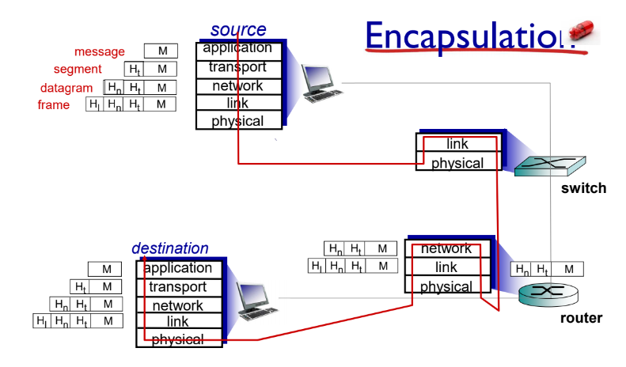

# DHCP and IP Header

> 작성자: {심세원}

## 목차
- [DHCP and IP Header](#dhcp-and-ip-header)
  - [목차](#목차)
- [DHCP](#dhcp)
- [How dose host get IP address](#how-dose-host-get-ip-address)
  - [Broadcast](#broadcast)
  - [DHCP Request, Response](#dhcp-request-response)
    - [1. 호스트는 브로드캐스트를 통해 DHCP 서버에 *'DHCP discover message'* 를 보냄](#1-호스트는-브로드캐스트를-통해-dhcp-서버에-dhcp-discover-message-를-보냄)
    - [2. DHCP 서버는 *'DHCP offer message'* 를 호스트에게 브로드 캐스팅을 통해 보냄](#2-dhcp-서버는-dhcp-offer-message-를-호스트에게-브로드-캐스팅을-통해-보냄)
    - [3. 호스트는 IP를 선택하여 *'DHCP request message'* 를 DHCP 서버에게 브로드 캐스팅을 통해 보냄](#3-호스트는-ip를-선택하여-dhcp-request-message-를-dhcp-서버에게-브로드-캐스팅을-통해-보냄)
    - [4. DHCP는 확인 했다는 의미의 *'DHCP ACK message'* 를 브로드 캐스팅으로 보냄](#4-dhcp는-확인-했다는-의미의-dhcp-ack-message-를-브로드-캐스팅으로-보냄)
- [Encapsulation](#encapsulation)
- [IP Header](#ip-header)

# DHCP
> 네트워크 연결을 위한 정보를 알아올 수 있게 하는 프로토콜

- UDP 통신

# How dose host get IP address
**어떻게 HOST는 IP 주소를 가질까?**
1. 수동으로 서브넷 관리자에게 물어보기
2. 자동으로 할당되기

자동으로 할당 해주는 것이 바로 **DHCP**
***DHCP***  : *Dynamic Host Configuration Protocal*

> 1. 호스트는 DHCP 서버에 자신의 IP를 달라고 요청
> 2. 서버는 응답하여, 호스트에게 IP를 할당

-> ***Host는 IP 주소가 없는데, 어떻게 서버에게 질의할까?***

## Broadcast
> 호스트가 속해있는 네트워크 전체를 대상으로 패킷을 전송하는 통신 방식

- 패킷의 목적지 주소가 `225.225.225.225`

## DHCP Request, Response
### 1. 호스트는 브로드캐스트를 통해 DHCP 서버에 *'DHCP discover message'* 를 보냄
```
[DHCP discover]
src : 0.0.0.0, 68
dest : 225.225.225.225, 67
```
- 67은 DHCP의 포트 번호
- DHCP가 아닌 서버는 요청에 무 반응함

### 2. DHCP 서버는 *'DHCP offer message'* 를 호스트에게 브로드 캐스팅을 통해 보냄
- **DHCP offer msg** : 호스트가 사용할 수 있는 IP 주소의 후보와 대여 시간이 있음
```
[DHCP offer]
src : 223.1.2.5, 67
dest : 225.225.225.225, 68
```
### 3. 호스트는 IP를 선택하여 *'DHCP request message'* 를 DHCP 서버에게 브로드 캐스팅을 통해 보냄
```
[DHCP request]
src : 0.0.0.0, 68
dest : 225.225.225.225, 67
```
### 4. DHCP는 확인 했다는 의미의 *'DHCP ACK message'* 를 브로드 캐스팅으로 보냄
- ack를 받아야 해당 IP를 사용할 수 있음
```
[DHCP ACK]
src : 223.1.2.5, 67
dest : 225.225.225.225, 68
```

# Encapsulation

레이어에 따라 Encapsulation을 해줌

# IP Header
- 기본 20 byte를 차지함
  - TCP, UDP 헤더도 기본 20 byte를 차지함

**구조**
- Version number
- Header Length
- Type-of-Service
- Total length
- Fragmentation information
- Time-To-Live
  - 무한루프 방지를 위해
- Transport Protocol
  - upper layer의 protocol(TCP, UDP)
- Checksum
  - 순결성 체크
- Destination IP address
- Source IP address